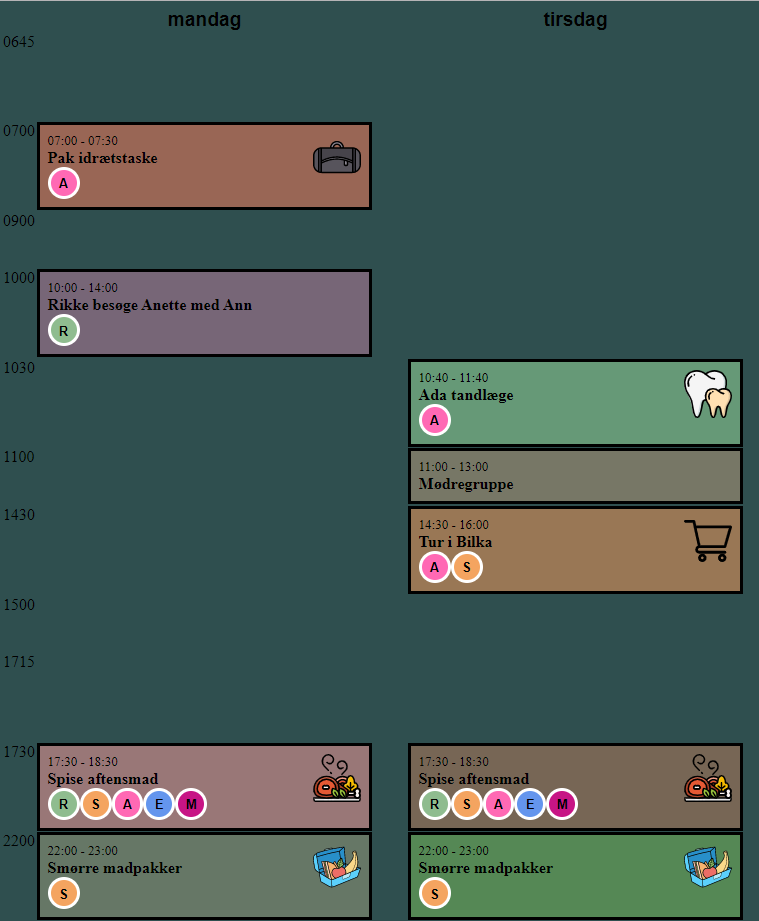

# family-calendar



## Building

Run this gradle task to build the uber-jar:
```
./gradlew quarkusBuild --uber-jar
``` 

## Setup

Enable Google calendar API; see https://developers.google.com/calendar/quickstart/java.

Download the credentials and save in project root directory.

## Google calendar event format

```
billede:<url>
hvem:<participants>
```

Here, `<url>` is a link to picture; e.g. `https://image.flaticon.com/icons/svg/124/124171.svg`

<participants>:
Ada
Ada,Steffen
Alle
```


## Configuration

### Users

TODO 

### Google calenders

TODO

# Putting it together

[Raspberry Pi setup guide](docs/raspberrypi)

